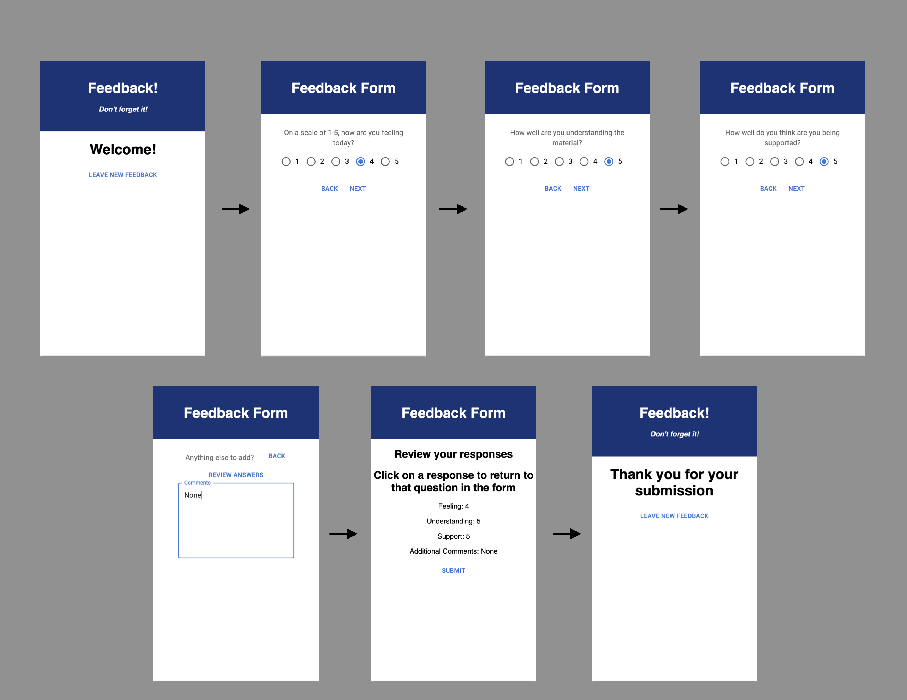
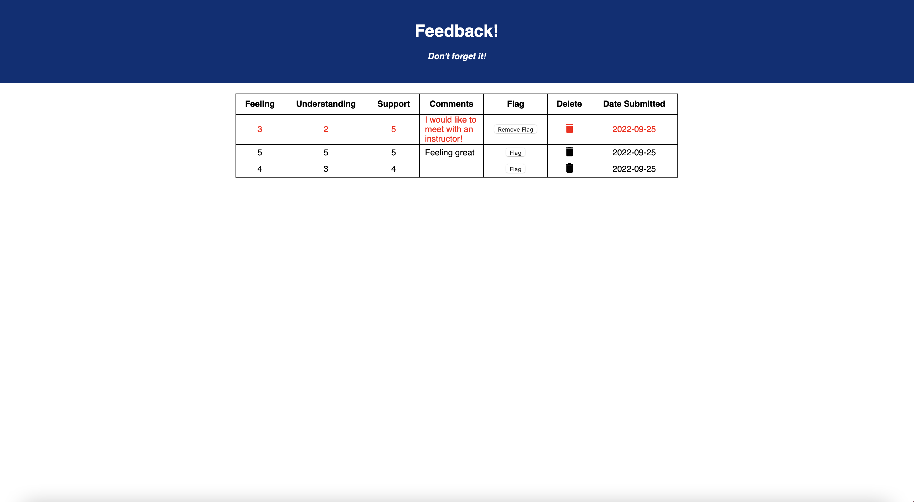

# React-Redux Feedback Loop

## Description
*Duration: Weekend assignment*

This weekend assignment required us to create a full-stack, four question feedback form using React and Redux. Each question and page was required to be its own React component, and routes were to be used to link each component together and return the user to the home page upon a successful feedback submission, thus creating a "feedback" loop!

Individual question responses were to be stored in the Redux store, and after user review, sent to the server-side database in a single POST request.

Stretch goals included allowing users to navigate back through the questionnaire to edit their responses, and the creation of an administrator page. This administrator page would display a table of all feedback submissions, with the option to flag individual responses or delete an entry entirely.

Images of the feedback loop and the admin page can be viewed below, and full assignment details can be found in [`INSTRUCTIONS.md`](INSTRUCTIONS.md)

## Final Product Snapshots

    The loop

    /admin

### Prerequisites
    • Node.js

## Installation and Setup

Visit the fully deployed app [here](https://damp-dusk-95049.herokuapp.com/)

Or, run it locally:

1. Clone this repository from Github
2. Create a database titled "prime_feedback" and create a "feedback" table using the initializer found in `database.sql`
3. Run `npm install` in your terminal to download the necessary modules
4. Run `npm run client` to start React
5. In a separate terminal, run `npm run server` to start the server
6. Visit http://localhost:3000 in your browser to view the project!

## Usage

Click the 'leave new feedback' button to start the questionnaire. Navigate using the 'next' and 'back' buttons on each question page.

On the review page, click on any response to return to that question in the form. Click the 'submit' button to send your feedback to the database.

To view all submitted feedback, flag entries, and delete entries, visit http://localhost:3000/#/admin

## Built With

* React
* Redux
* JavaScript
* HTML
* CSS
* Material UI
* Express 
* Axios
* Node-Postgres

## Acknowledgement

Special thanks to [Prime Digital Academy!](https://github.com/PrimeAcademy) 
